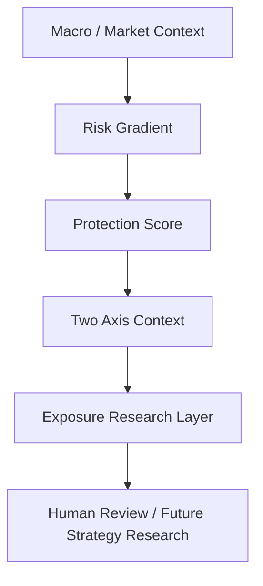

# Adaptive Exposure V6 Architecture Freeze

Generated for MyInvestCycle after V6.6 information attribution.

## 1. Final Positioning

Adaptive Exposure V6 is frozen as a research and explanation layer, not as an execution policy.

The research chain has proven useful for risk environment recognition. It has not proven that opportunity prediction or automatic exposure increase is reliable enough for mapper, ETF weight, or trade generation.

Current retained architecture:

## 2. Retained Layers

| Layer | Source | Role | Final Use |
| --- | --- | --- | --- |
| Risk Gradient | V5.10-V5.13 | Core risk axis | Keep as primary risk diagnostic |
| Protection Score | V6.3-V6.4 | Risk confirmation layer | Keep as confirmation, not replacement |
| Two Axis Context | V6.5 | Research environment map | Keep as context map, not policy |
| Information Attribution | V6.6 | Layer value audit | Keep as frozen audit record |

### Risk Gradient

Risk Gradient is the primary retained risk axis. In the V6.6 common sample, it produced risk spread of +15.71 percentage points and was classified as `risk_value_only`.

It should be used to explain whether the environment is risk enriched. It should not directly produce exposure, ETF weights, orders, or automatic trades.

### Protection Score

Protection Score is retained as a confirmation layer. It did not outperform Risk Gradient as a standalone risk axis, but it improved context interpretation and helped form the combined risk map.

In V6.6, it was classified as `weak_risk_value` with retention recommendation `keep_as_risk_confirmation_layer`.

### Two Axis Context

Two Axis Context combines fixed V6.3 participation/protection buckets into four research labels:

| Label | Meaning |
| --- | --- |
| PARTICIPATE | High participation, non-high protection |
| PROTECT_BUT_PARTICIPATE | High participation, high protection |
| WAIT | Non-high participation, non-high protection |
| AVOID | Non-high participation, high protection |

In V6.6, it led the risk and opportunity spread rankings, but it remains a research context map. It must not be treated as an allocation policy.

## 3. Downgraded Or Rejected Layers

| Layer | Reason | Final Status |
| --- | --- | --- |
| V5.1 Exposure Level | Common V6.6 sample is all BALANCED, risk/opportunity spread both 0 | Baseline only |
| Participation Score | High participation did not meaningfully lift future opportunity rate | Do not use for exposure increase |
| More context states | Marginal value is falling and overfitting risk is rising | Stop adding states |
| Direct mapper change | Risk information is research-useful but not execution-ready | Not allowed |

## 4. Research Conclusions

V5-V6 answered four questions:

| Question | Answer |
| --- | --- |
| Can the system identify risk-enriched environments? | Yes, with research value |
| Can risk diagnostics directly change exposure? | No |
| Can the system predict opportunity strongly enough to raise exposure? | No |
| Should V6 continue adding context states? | No |

The most important conclusion is asymmetric:

- Risk recognition has research value.
- Opportunity prediction is weak.
- Automatic exposure increase is not validated.
- The next strategy layer should not assume that high participation score means buy or add exposure.

## 5. Hard Boundaries

Adaptive Exposure V6 does not:

- generate portfolio weights,
- generate ETF allocation,
- generate buy/sell orders,
- connect to brokers,
- alter the exposure mapper,
- alter existing strategy routing,
- optimize return,
- optimize parameters after seeing outcomes.

Future labels are used for validation only. They must not enter signal construction.

## 6. Required Data Artifacts

The frozen architecture depends on these generated artifacts:

| Artifact | Purpose |
| --- | --- |
| `data/exposure_gradient_analysis.json` | V5.10 risk/opportunity gradient |
| `data/risk_gradient_robustness.json` | V5.11 risk gradient stability |
| `data/exposure_context_score_audit.json` | V6.3 participation/protection scores |
| `data/protection_score_validation.json` | V6.4 protection score validation |
| `data/two_axis_context_validation.json` | V6.5 two-axis context validation |
| `data/context_information_attribution.json` | V6.6 layer attribution |

## 7. Final Architecture Decision

Freeze Adaptive Exposure V6 as:

1. Risk Gradient: primary risk axis.
2. Protection Score: risk confirmation layer.
3. Two Axis Context: research environment map.
4. Information Attribution: frozen evidence record.

Do not continue adding exposure context states. The next phase should either:

- document and package the current research results, or
- start a separate opportunity-side research program focused on structure, style, and asset rotation rather than broad-market exposure labels.
